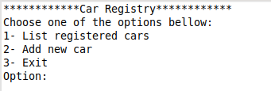
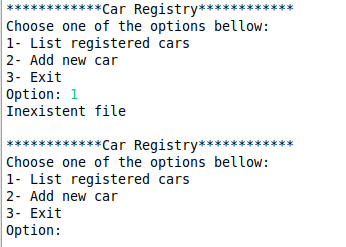
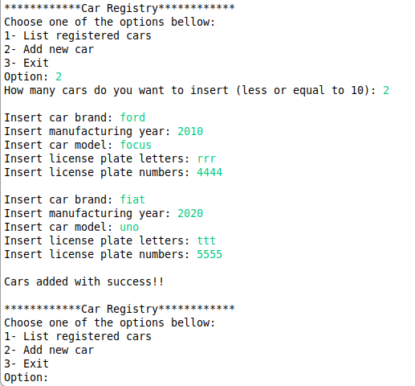
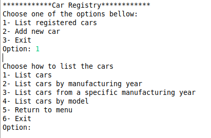
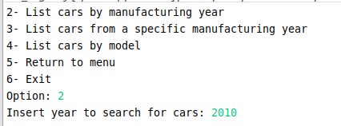

# car_registry
program to register vehicles to a file

This is a program written in C language to register cars into a file. 
The functionalities are displayed in the console. So, to use it you need a code editor with a compiler for C.
There are also many IDEs that have an embeded compiler.

When you first compile and run the program, a few options will be given

If you press to list the cars but the file still doesn't exist, you will get a warning and return to the menu

Pressing "2" to add a car, you will get to choose how many cars to add and prompt the information required (brand, year, model, license plate). 
The file will automatically be created. And return to the main menu.

When there is already a file, you can choose how to list the cars. You will then be taken to a secondary menu

The first option will simply list the cars in the file displaying it in ascending order from the manufacturing year and return to the main menu

Your second option is to filter and display the list of from a certain year. You will be prompted to give a year. 
After displaying it, the program returns to the main menu 

The third option also prompts the user with a specific year and displays all cars manufactured from that year

The fourth option will search and filter cars by model in the same way. 

Finally you can return to the main menu by pressing "5" or exit the program pressing "6" 
